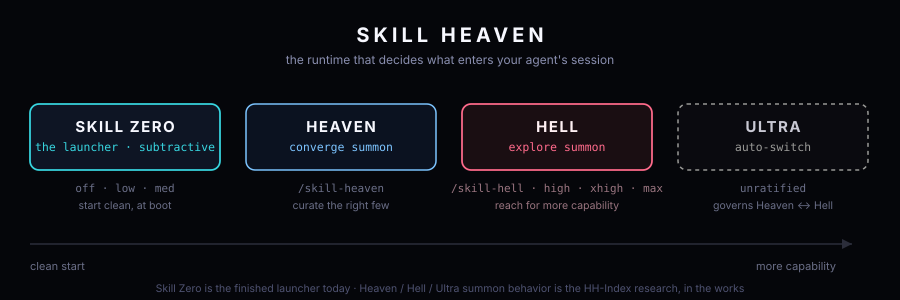

# gaia-skill-heaven

**Skill Heaven is the umbrella runtime brand. Skill Zero is its launcher: a complete, usable prototype for starting AI coding harnesses with less ambient skill context, while still shipping the Hell-side summon door when you need more capability.**

Skill Zero currently targets **Claude Code, Codex, Pi, Hermes, and Grok**. It gives the launcher its own name instead of overloading “Skill Heaven” for the umbrella, the launcher, and the axis all at once.

### Gaia Ecosystem
[](https://gaiaskilltree.com/)
[](https://research.gaiaskilltree.com/)
[](https://gaia-research.github.io/gaia-skill-heaven/)

---

## What lives here

This repo is the **gaia-skill-heaven monorepo**:

- **Skill Heaven** — the umbrella runtime brand
- **Skill Zero** — the launcher engine and per-harness doors
- **Skill Hell** — the live summon door the launcher ships alongside the zero launcher surface

The launcher is already usable today:

- `skill-zero` — shared engine / research driver
- `claude-zero`
- `pi-zero`
- `codex-zero`
- `hermes-zero`
- `grok-zero`
- `skill-hell` — live summon engine, installed alongside the doors

---

## Install

Requires **Node.js 22 or newer**.

```bash
curl -fsSL https://gaia-research.github.io/gaia-skill-heaven/install.sh | sh
```

This installs the Skill Zero launcher doors plus the Hell summon door:

```text
claude-zero
codex-zero
pi-zero
hermes-zero
grok-zero
skill-hell
```

The installer **does not install the harnesses themselves**. You still install Claude Code, Codex, Pi, Hermes, or Grok normally.

Default install location:

```bash
$HOME/.local/share/gaia-skill-heaven/bin
```

If needed, add it to your `PATH`:

```bash
export PATH="$HOME/.local/share/gaia-skill-heaven/bin:$PATH"
```

---

## Quick start

Launch the Claude door:

```bash
claude-zero
```

Or another harness:

```bash
codex-zero
pi-zero
hermes-zero
grok-zero
```

Inspect the launch plan without spawning the harness:

```bash
claude-zero --print
codex-zero --print
pi-zero --print
hermes-zero --print
grok-zero --print
```

You can also drive the shared engine directly:

```bash
skill-zero --harness claude --level off --print
```

---

## Skill Zero levels and postures

Skill Zero keeps the launcher surface intentionally small. Its user-facing levels are Heaven rungs:

| Level | Posture mechanic | Meaning |
|---|---|---|
| `off` | `product-floor` | Launch the cleanest supported product floor |
| `low` | `curated` | Launch clean, then admit only the skills you name |
| `med` | `native` | Keep the harness native |

Under the hood those levels map onto the posture mechanics already implemented in this repo:

- **floor** — benchmark-only doorless floor
- **product-floor** — the smallest launchable zero surface that keeps the door
- **curated** — only the skills you explicitly admit
- **native** — your normal harness setup

The exact route differs by harness, but the product meaning stays the same: Skill Zero composes a temporary session environment instead of mutating your shared config.

The per-harness doors also ship the in-session command set for navigating the runtime surface:

```text
/skill-heaven
/skill-zero
/skill-hell
/skill-ultra
```

Heaven is the convergent, curated summon direction; Hell is exploratory summon; Ultra is the future auto-switch across those directions. Skill Zero owns the launch-time reduction to a cleaner starting context.

---

## Curated launches

For a curated launch, provide one or more `SKILL.md` files or skill directories:

```bash
skill-zero \
  --level low \
  --harness claude \
  --skill ./skills/my-skill
```

Inspect first if you want the exact plan:

```bash
skill-zero \
  --level low \
  --harness claude \
  --skill ./skills/my-skill \
  --print
```

Most users will prefer the per-harness doors such as `claude-zero` or `pi-zero`.

---

## Hell-side summoning

Skill Zero launches clean, but the broader Skill Heaven runtime still includes the live Hell summon door:

```bash
skill-hell summon "code review" --card
```

Or directly from npm:

```bash
npx --yes skill-hell@latest summon "code review" --card
```

Today this remains a manual summon surface. It does **not** yet auto-route from HH Index research results.

---

## Harness support

| Harness | Status |
|---|---|
| Claude Code | Supported |
| Codex | Supported |
| Pi | Supported |
| Hermes | Supported |
| Grok | Supported |
| Cursor | Recipe / inspection only |

Skill suppression is not equally powerful on every harness. Skill Zero favors **fail-closed behavior**: if a clean launch cannot be performed reliably, it should say so rather than pretending the environment is clean.

---

## How it works

Skill Zero does not modify your normal agent installation.

The launcher creates a temporary session environment, composes the right harness flags and configuration, starts the original harness binary, and removes the temp state when the session exits.

Your normal configuration stays intact.

---

## HH Index — axis / research *(in the works)*

Skill Heaven also names the broader **axis and research program** around Heaven, Hell, and Ultra behavior.

The Hell-Heaven Index asks a simple question:

> **When does adding more capability help, and when does it just add context entropy?**

That axis/research work is still **in the works** and lives in `gaia-research`. The current launcher does **not** automatically route skills from HH Index results yet.

[](https://research.gaiaskilltree.com/research/hh-benchmark)

---


---

## Uninstall

```bash
$HOME/.local/share/gaia-skill-heaven/uninstall.sh
```

---

## Research & project docs

- [Hell / Heaven benchmark](https://research.gaiaskilltree.com/research/hh-benchmark)
- [Gaia Skill Tree](https://gaiaskilltree.com/)
- [Gaia Research](https://research.gaiaskilltree.com/)
- [Vision](https://github.com/gaia-research/gaia-research/blob/main/docs/skill-heaven/VISION.md)
- [Mission](https://github.com/gaia-research/gaia-research/blob/main/docs/skill-heaven/MISSION.md)

---

## Development

```bash
npm install
npm test
npm run launcher -- --level off --print
```

Node.js **22+**. TypeScript ESM. No harness binaries are installed as package dependencies.
