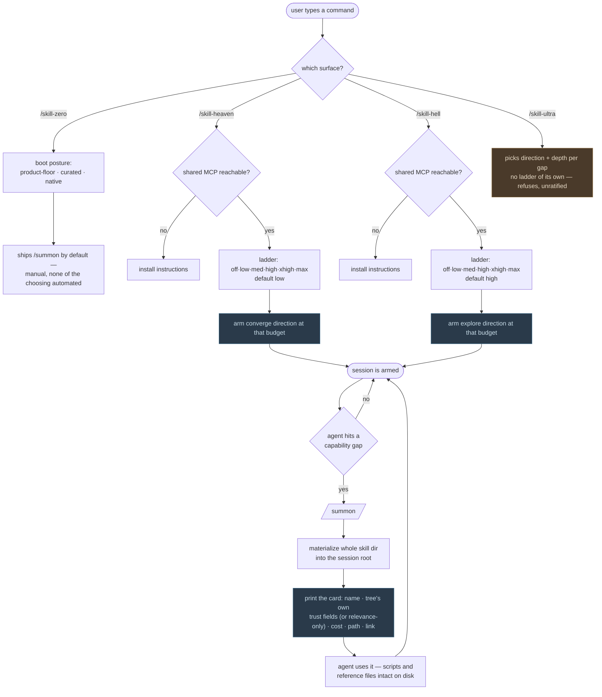

# The Ladder — one mechanic, four surfaces

**Founder ruling, N12 (2026-08-15).** Supersedes the 2026-08-07 "two ladder
halves" reading this doc used to carry: Heaven and Hell are no longer opposite
halves of one seven-rung axis. Each direction now carries the **full** ladder,
and `ultra` is no longer a rung on it at all — it moved up, to become the
controller over both directions.

## The mechanic

`/summon` is the mechanic — **one skill into context, one session, nothing
installed** — and it is present in **every implementation, at every rung, on
every door**, copied straight from how `skill-hell` already does it. Nothing
below is a different mechanic; it's a different amount of automation wrapped
around the same single act.

## Four surfaces, not two halves

```
   SKILL ZERO              /skill-heaven            /skill-hell            /skill-ultra
   (the floor)              (converge)                (explore)             (the controller)
 ┌────────────────┐   ┌─────────────────────┐  ┌─────────────────────┐  ┌───────────────────┐
 │ ships /summon   │   │ off·low·med·high·    │  │ off·low·med·high·    │  │ picks direction +  │
 │ by default —    │   │ xhigh·max             │  │ xhigh·max             │  │ depth per gap —    │
 │ manual, none of │   │ default: low          │  │ default: high         │  │ NO ladder of its   │
 │ the choosing    │   │                       │  │                       │  │ own, no rung, never │
 │ is automated    │   │                       │  │                       │  │ a slider            │
 └────────────────┘   └─────────────────────┘  └─────────────────────┘  └───────────────────┘
      boot-time              └──────── live, additive, one shared MCP ────────┘      sits above both
      (D12, unchanged)
```

- **Skill Zero** is the product floor: it ships `/summon` by default, with
  none of the choosing automated. Its own boot-time dial
  (`--level off|low|med` → `product-floor|curated|native`) is **unchanged by
  N12** and still governed by D12 below — it decides what's *ambient* at
  launch, a different question from how much gets auto-summoned afterward.
- **`/skill-heaven` (converge)** and **`/skill-hell` (explore)** are two
  directions of the same summon, over **one shared MCP**. Each carries the
  **same discrete ladder, `off…max`**, setting **how many skills the agent
  may auto-summon per capability gap**. The ladder is **per direction** — you
  can sit at `low` in Heaven and `high` in Hell in the same session; there is
  no single shared position between them.
- **`/skill-ultra`** is the controller: it picks direction and depth per gap
  and has **no ladder of its own** — no rung, and never a slider. This
  supersedes the earlier placement of `ultra` as a rung above Hell; the
  ledger's frozen arm key is unaffected by the rename.

## The rungs (PROVISIONAL until the benchmark lands)

Per-rung counts and the per-direction defaults are **provisional** — they do
not land until the Hell/Heaven benchmark does. Every surface that renders one
of these numbers must say so.

| Rung | Skills auto-summoned per capability gap (working mapping) |
|---|---|
| `off` | 0 |
| `low` | 1 |
| `med` | 2 |
| `high` | 3 |
| `xhigh` | 4 |
| `max` | 5 |

`/skill-heaven` defaults to `low`; `/skill-hell` defaults to `high`. Both
directions are reachable at every rung — **Hell is not gated, locked, or
refused at any of them.** `/skill-ultra` is the only surface here that
refuses, and only because it is unratified, never because it is gated.

`floor` is **not on the ladder.** It is the doorless benchmark
placebo-of-record, byte-frozen, reachable only as `--posture floor`. Users
never select it.

## Why boot-time and live are still different things

Not a policy choice — a capability one, and this part of the old doc still
holds.

**Skill Zero's boot posture is subtractive.** `product-floor`, `curated`, and
`native` differ by how much of your ambient setup is *withheld*. A running
session cannot un-load what it already loaded (D12), so choosing one of these
postures is a decision that can only be made **at boot**. That is why the
launcher owns them, not either summon direction.

**The Heaven/Hell ladder is additive.** `off` through `max` differ by how
freely skills are *summoned in* on top of whatever the session already
booted at. Adding context to a live session is something every harness can
do — that is why `/skill-heaven` and `/skill-hell` both work live, launcher
or not, native session or not, and why raising either ladder in-session is
always allowed (upward-only, same D12 constraint, just applied to a
different dial now).

## Stamps are not built

Heaven/Hell stamps remain **out of scope**. Routing falls back to relevance
ranking, and no surface may present stamp-gated routing as running — Skill
Heaven is the surface that will eventually consume stamps, but nothing
consumes them yet.

## Flow



## Summoning is ambient, not a search box

Arming either direction's ladder does not fetch one skill and stop. Once
armed, the agent summons on its own when it needs something, and the user
never types another command.

Each arrival prints a card — identity, whatever trust fields *the tree
published* (or an explicit "relevance-only" disclosure when it published
none — see Stamps above), install cost (timing always paired with cold/warm
cache state), on-disk path, and a link to inspect it.

Two properties make this work:

- **The whole directory lands on disk**, not just `SKILL.md` — `reference/`,
  `scripts/`, fixtures. That is what makes a summoned skill genuinely usable
  rather than quoted.
- **The card is what makes it known.** Claude builds its skill listing at
  boot and has no mid-session load path (probed, Claude Code 2.1.224). A
  directory written at minute 40 is on disk but invisible to the model. The
  card is the listing entry — and it is far cheaper than pasting the entire
  body, which is what the first prototype did.

`skill-hell summon <intent>` stays available for users who want to name the
skill themselves. That is the advanced path, not the default one.

## Session roots stay warm

Summoned skills live in a session root, never in the user's repo and never in
`~/.claude`. The root survives the session so a later one re-attaches instead
of re-cloning — hot on the iron. A TTL and an LRU payload cache bound the
disk cost.

## What a tree must provide

Nothing beyond an identity. Trust fields — stars, rank, Trust Magnitude,
anything a tree invents — are **carried through and displayed if present,
omitted if absent**. When a tree publishes no trust signal, ranking falls
back to relevance and *says so*, so a caller can tell trust-ranked from
text-matched. A new tree must be able to add a trust dimension we have never
heard of and have it display without an engine change.
