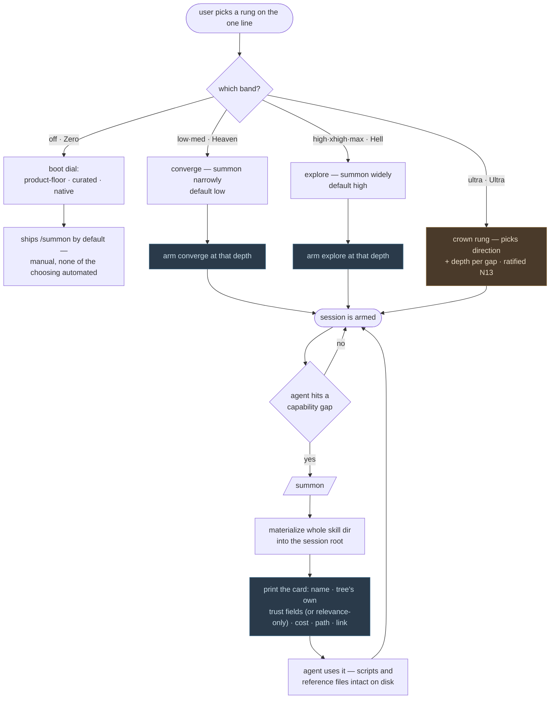

# The Ladder — one mechanic, one line, four surfaces

**Founder ruling, N13 (2026-08-15, corrective).** Restores the single-scale
reading and supersedes the "two independent ladders" reading N12 briefly
carried. There is **one ladder — one line** — and the four surfaces are
contiguous **bands** on it, not four separate controls. `ultra` is the
**crown** of that one line: the controller above everything, rendered as its
seventh selectable rung so the whole thing reads as a single continuous axis.

## What the ladder measures — skill entropy

Everything else in this document describes the ladder's *shape*: seven rungs,
four bands, which command opens where. This section is the reason the shape is
what it is. **Skill entropy is what the ladder measures. The rungs are
skill-entropy levels.**

**Skill entropy is how much skill variety and volume enters a session.** One
skill, chosen tightly for the gap in front of you, is low skill entropy. Many
skills, reaching wide around the gap, is high skill entropy. The ladder is a
scale of that quantity and a rung is a position on it. Everything below —
the rung names, the two directions, the crown — follows from reading it that
way.

**It is a product concept, not an information-theoretic one.** There is no
formula behind it, no unit, no threshold and no number. Nothing in this
repository computes a skill-entropy value, and nothing should start. The term
earns its place by explaining what the line is a line *of* — not by being
measurable today.

### Why each rung is named what it is

- **`zero` — zero skills, and so zero skill entropy.** This is why the floor
  rung is spelled `zero`. The earlier spelling was `off`, and `off` named a
  switch position: a state the product is in. `zero` names the quantity: a
  value of the thing the line measures. That rename is what puts the bottom
  rung on the same scale as every rung above it instead of outside them.
- **`low → med → high → xhigh → max` — rising skill entropy.** Not five
  settings that happen to be ordered, but five readings of one quantity. It is
  why moving between them is *climbing* a line rather than *switching* a mode.
- **`ultra` — the rung that chooses the reading**, rather than being one. See
  below.

### Why the two directions are directions *along* it

Heaven and Hell are the two ways to move along skill entropy. That is precisely
what makes them one line and not two products:

- **Heaven (`low · med`) converges — the lower-entropy direction.** It narrows
  onto the gap: the right few skills for what is in front of you.
- **Hell (`high · xhigh · max`) explores — the higher-entropy direction.** It
  widens around the gap: more experts in context rather than the closest one.

The ratified summon directions *are* those two directions, stated in the terms
that explain them. Nothing about the mechanic itself changes across the line —
`/summon` is the same single act at every rung on every door. What a rung sets
is **which way along skill entropy the agent moves, and how far along that band
it sits.** No rung carries a count and no summon is capped; how far to reach on
a given gap is the agent's call.

### Why `ultra` is the crown of the same line

`ultra` picks the skill entropy **per gap** — direction and depth both, gap by
gap, instead of once per session. That is why it is the crown of the one line
and not a fifth mode standing beside it: it operates on the very quantity the
line measures. A control that set some *other* quantity would belong somewhere
else; this one sets the same one, from above. It has no sub-ladder of its own
because it is the top of the one it controls.

### What the benchmark is for — the entropy curve

The Hell/Heaven benchmark's job is the **entropy curve**: how quality and cost
move together as skill entropy rises. That is deliberately *not* a
token-savings headline — cheaper is not the thesis; knowing what rising
skill entropy buys and what it costs is.

The curve is expected to rise and then turn. Skill Hell routes summons through
gaia mcp as a **mixture-of-agents for skills** (D5), so climbing puts more
experts in context: better, until it isn't. Where "isn't" begins is what the
benchmark exists to find.

**None of this is measured today. The benchmark is not built.** No curve has
been plotted, no turn has been located, and no rung has been shown to beat any
other on any task. Heaven's representative rung `low` and Hell's `high` are
provisional defaults, not findings. This section states the concept the
instrument is being built to test — any surface that presents it as a result
is a bug.

## The mechanic

`/summon` is the mechanic — **one skill into context, one session, nothing
installed** — and it is present in **every implementation, at every rung, on
every door**, copied straight from how `skill-hell` already does it. Nothing
below is a different mechanic; it's a different amount of automation wrapped
around the same single act.

## One line, read as four bands

A session sits at **exactly one rung** — one position on skill entropy. Which
surface you are in is **read from the rung** — you do not hold a Heaven
position and a Hell position at the same time, because you cannot sit at two
readings of one quantity at once.

```
  ZERO        HEAVEN            HELL                     ULTRA
 (floor)     (converge)        (explore)              (the controller)
  ┌────┬───────────────┬───────────────────────────┬─────────┐
  │ zero│  low   med    │  high    xhigh    max      │  ultra  │
  └────┴───────────────┴───────────────────────────┴─────────┘
  floor   ◀── converge ──▶   ◀────── explore ──────▶     crown
   ships   ▲ default low     ▲ default high          picks direction
  /summon                                             + depth per gap
  (manual)  └─────── auto-summons per capability gap ───────┘
```

- **`zero` — Skill Zero.** The product floor: zero skills, zero skill entropy.
  Ships `/summon` by default, with **none of the choosing automated**. This is
  the bottom of the one line.
- **`low · med` — Skill Heaven (converge).** The lower-entropy direction.
  Auto-summons narrowly — the right few skills for the gap in front of you.
  Representative rung: `low`.
- **`high · xhigh · max` — Skill Hell (explore).** The higher-entropy
  direction. Auto-summons widely — more experts in context, better until it
  isn't. Representative rung: `high`.
- **`ultra` — Skill Ultra.** The crown rung. It picks the direction **and**
  the depth per gap — the skill entropy itself, chosen gap by gap. It sits on
  the same line as its top rung (selectable directly, alongside Heaven and
  Hell) because there is one axis and it operates on that axis; it has no
  sub-ladder of its own because it **is** the top of the one. Never a slider
  (N1).

Selecting a surface selects into its band; selecting an individual rung
fine-tunes within it. **Nothing on the line refuses** — every rung and band
is reachable. Hell is not gated, locked, or sealed, and neither is Ultra;
what is outstanding on the upper band is implementation, not permission.

## The rungs — no counts, no caps

**Correction (owner ruling, 2026-08-19).** The working mapping this section
used to carry — `off 0 · low 1 · med 2 · high 3 · xhigh 4 · max 5` — is
withdrawn. **No count was ever assigned to a rung, and no cap was ever assigned
to a summon.** A rung names a *direction* and a position along its band; how far
to reach on a given gap is the agent's call, worked out **in use** — by the
agent using the product — while the benchmark is built.

The bottom rung is spelled **`zero`**, matching its band and its surface. The
earlier `off` spelling is retired.

| Rung | Band | What it means |
|---|---|---|
| `zero` | Zero | nothing automatic — manual `/summon` only |
| `low` | Heaven | converge — the band opens here |
| `med` | Heaven | converge — further along the band |
| `high` | Hell | explore — the band opens here |
| `xhigh` | Hell | explore — further along the band |
| `max` | Hell | explore — further along the band |
| `ultra` | Ultra | the crown rung — picks direction + depth per gap |

Heaven's representative rung is `low`; Hell's is `high`. Those defaults remain
**provisional** until the benchmark lands. Every surface that renders the line
carries a `WIP · PROVISIONAL` mark.

`floor` is **not on the line.** It is the doorless benchmark
placebo-of-record, byte-frozen, reachable only as `--posture floor`. Users
never select it.

## Two dials that share the bottom rung

`zero` is where the one line meets Skill Zero's own **boot dial**, and the two
are different questions — worth keeping straight.

**Skill Zero's boot dial is subtractive.** `--level zero|low|med →
product-floor | curated | native` decides how much of your ambient setup is
*withheld at launch*. A running session cannot un-load what it already loaded
(D12), so that decision can only be made **at boot** — which is why the
launcher owns it. (These `low|med` are boot postures of the launcher, **not**
the global line's Heaven rungs; the collision of names is historical.)

**The summon line is additive.** `low` through `max` differ by how freely
skills are *summoned in* on top of whatever the session already booted at.
Adding context to a live session is something every harness can do — that is
why summoning works live, launcher or not, native session or not, and why
climbing the line in-session is always allowed (upward-only, same D12
constraint applied to a different dial).

## Stamps are not built

Heaven/Hell stamps remain **out of scope**. Routing falls back to relevance
ranking, and no surface may present stamp-gated routing as running — Skill
Heaven is the surface that will eventually consume stamps, but nothing
consumes them yet.

## Flow



## Summoning is ambient, not a search box

Sitting anywhere above `off` does not fetch one skill and stop. Once armed,
the agent summons on its own when it needs something, and the user never
types another command.

Each arrival prints a card — identity, whatever trust fields *the tree
published* (or an explicit "relevance-only" disclosure when it published
none — see Stamps above), install cost (timing always paired with cold/warm
cache state), on-disk path, and a link to inspect it.

Two properties make this work:

- **The whole directory lands on disk**, not just `SKILL.md` — `reference/`,
  `scripts/`, fixtures. That is what makes a summoned skill genuinely usable
  rather than quoted.
- **The card is what makes it known.** Claude builds its skill listing at
  boot and has no mid-session load path (probed, Claude Code 2.1.224). A
  directory written at minute 40 is on disk but invisible to the model. The
  card is the listing entry — and it is far cheaper than pasting the entire
  body, which is what the first prototype did.

`skill-hell summon <intent>` stays available for users who want to name the
skill themselves. That is the advanced path, not the default one.

## Session roots stay warm

Summoned skills live in a session root, never in the user's repo and never in
`~/.claude`. The root survives the session so a later one re-attaches instead
of re-cloning — hot on the iron. A TTL and an LRU payload cache bound the
disk cost.

## What a tree must provide

Nothing beyond an identity. Trust fields — stars, rank, Trust Magnitude,
anything a tree invents — are **carried through and displayed if present,
omitted if absent**. When a tree publishes no trust signal, ranking falls
back to relevance and *says so*, so a caller can tell trust-ranked from
text-matched. A new tree must be able to add a trust dimension we have never
heard of and have it display without an engine change.
