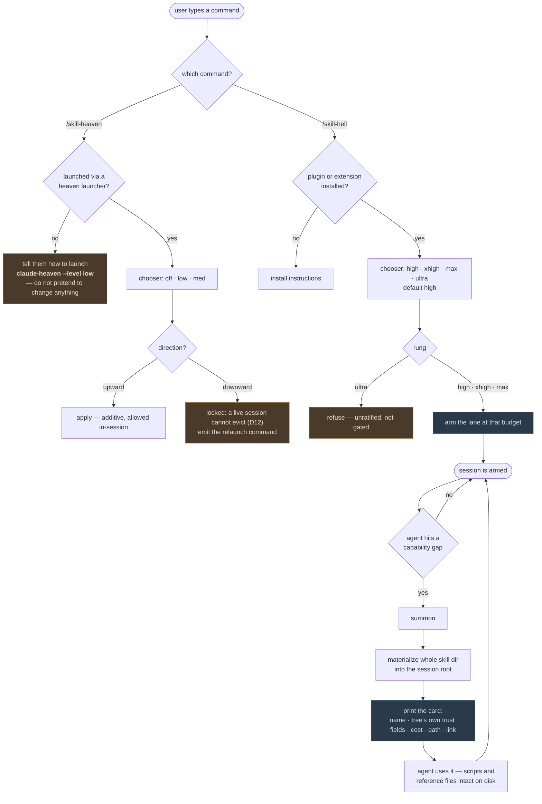

# The Ladder — two halves, two commands

**Founder ruling, 2026-08-07.** The entropy ladder is one line of seven rungs, but it is
served by two commands that own different halves of it, because the halves are not the same
kind of thing.

```
        HEAVEN  (subtractive)                 HELL  (additive)
   ┌──────────────────────────────┐   ┌──────────────────────────────────┐
   off  ·  low  ·  med            │   │  high  ·  xhigh  ·  max  ·  ultra
   │       │      └─ = native     │   │   └─ default
   │       └─ curated             │   │
   └─ product-floor               │   │
   ┌──────────────────────────────┘   └──────────────────────────────────┐
   │  /skill-heaven                        /skill-hell                   │
   │  needs the LAUNCHER                   needs only the PLUGIN         │
   └──────────────────────────────────────────────────────────────────────┘
```

## Why the split falls exactly here

Not a policy choice — a capability one.

**Heaven is subtractive.** `off`, `low`, and `med` differ by how much of your ambient setup is
*withheld*. A running session cannot un-load what it already loaded (D12), so choosing a Heaven
rung is a decision that can only be made **at boot**. That is why `/skill-heaven` requires the
launcher: without one, there is no boot to configure, and the honest answer is to say so.

**Hell is additive.** `high` through `ultra` differ by how freely skills are *summoned in*.
Adding context to a live session is something every harness can do. That is why `/skill-hell`
works anywhere the plugin or extension is installed — launcher or not, native session or not.

So D12 stops being an obstacle. It is the reason the two commands exist and the line between
them sits where it does.

## The rungs

| Rung | Half | Posture | Meaning |
|---|---|---|---|
| `off` | Heaven | `product-floor` | Near-empty. Nothing ambient loads; the door stays reachable. |
| `low` | Heaven | `curated` | Only what you named. |
| `med` | Heaven | `native` | Your setup, untouched. The top of Heaven, not a locked rung. |
| `high` | Hell | — | **Default.** Summon on demand when the agent hits a gap. |
| `xhigh` | Hell | — | Wider net per gap. |
| `max` | Hell | — | Widest ratified. |
| `ultra` | Hell | — | **Unratified.** Refuses, and says it is unratified rather than gated. |

`floor` is **not on the ladder.** It is the doorless benchmark placebo-of-record, byte-frozen,
reachable only as `--posture floor`. Users never select it.

Hell rungs do **not** map to postures. They are a summon budget layered on top of whichever
posture the session booted at — which is what lets `/skill-hell` work in a session that never
saw a launcher.

## Flow



## Summoning is ambient, not a search box

`/skill-hell` **arms the lane**; it does not fetch one skill and stop. After arming, the agent
summons on its own when it needs something, and the user never types another command.

Each arrival prints a card — identity, whatever trust fields *the tree published*, install cost
(timing always paired with cold/warm cache state), on-disk path, and a link to inspect it.

Two properties make this work:

- **The whole directory lands on disk**, not just `SKILL.md` — `reference/`, `scripts/`,
  fixtures. That is what makes a summoned skill genuinely usable rather than quoted.
- **The card is what makes it known.** Claude builds its skill listing at boot and has no
  mid-session load path (probed, Claude Code 2.1.224). A directory written at minute 40 is on
  disk but invisible to the model. The card is the listing entry — and it is far cheaper than
  pasting the entire body, which is what the first prototype did.

`skill-hell summon <intent>` stays available for users who want to name the skill themselves.
That is the advanced path, not the default one.

## Session roots stay warm

Summoned skills live in a session root, never in the user's repo and never in `~/.claude`.
The root survives the session so a later one re-attaches instead of re-cloning — hot on the iron.
A TTL and an LRU payload cache bound the disk cost.

## What a tree must provide

Nothing beyond an identity. Trust fields — stars, rank, Trust Magnitude, anything a tree
invents — are **carried through and displayed if present, omitted if absent**. When a tree
publishes no trust signal, ranking falls back to relevance and *says so*, so a caller can tell
trust-ranked from text-matched. A new tree must be able to add a trust dimension we have never
heard of and have it display without an engine change.
